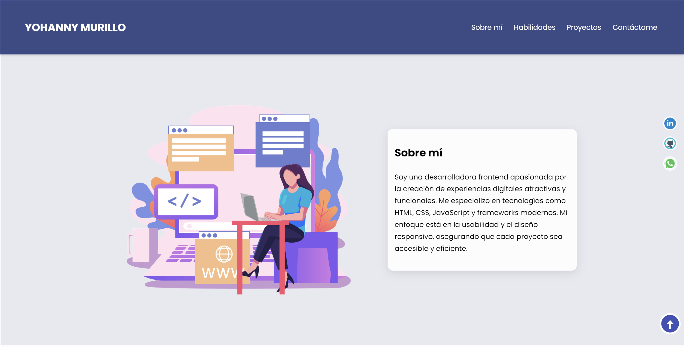

# PORTFOLIO

Imagen

## Github repo

[link](https://github.com/Hany-m/mi-portafolio) 

## Sitio web

Demostración [link]()

## Tecnología

**Usado:** HTML, CSS,  JavaSCript

## Herramientas usadas

Imagenes y herramientas utilizadas:

- [Ion Icons](https://ionic.io/ionicons) menu hamburguesa
- [Drawkit](https://es.vecteezy.com) Ilustración YM
- [Icon8](https://icons8.com/) Iconos
- [Animate CSS](https://animate.style/) Animación texto Bio
- [Formspree](https://formspree.io/) Envío  de formulario
